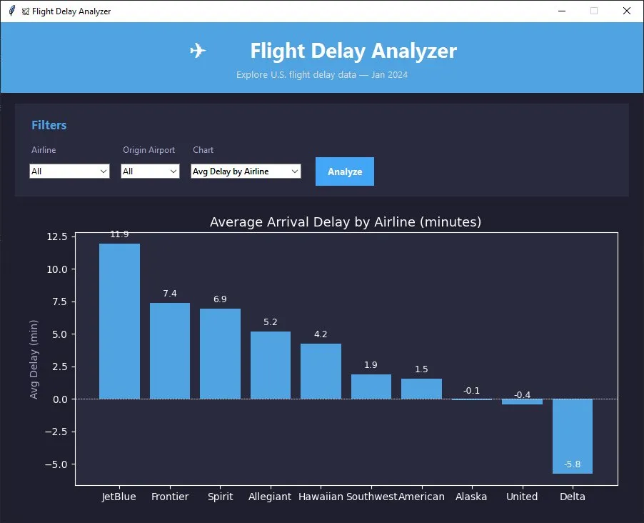

# ✈️ Flight Delay Analyzer

A desktop application for exploring real U.S. flight delay data, built with Python.



---

## Features

- **Real Data** — Analyzes 600,000+ flights from the Bureau of Transportation Statistics
- **Airline Filter** — Drill down into a specific airline's performance
- **Airport Filter** — Filter by origin airport
- **4 Chart Types:**
  - Average Arrival Delay by Airline
  - Average Delay by Airport (Top 15)
  - Delay Causes Breakdown (Carrier, Weather, NAS)
  - Cancellation Rate by Airline
- **Summary Stats** — Total flights, avg delay, and cancellation rate displayed at a glance
- **Clean Dark UI** — Built with Tkinter and a modern dark theme

---

## Tech Stack

- **Python 3.10**
- **Pandas** — Data loading, cleaning, and filtering
- **Matplotlib** — Embedded interactive charts
- **Tkinter** — GUI framework

---

## Data Source

Flight data sourced from the [Bureau of Transportation Statistics](https://www.transtats.bts.gov/) — January 2024 domestic U.S. flights.

---

## Getting Started

### Prerequisites

- Python 3.10 or higher
- pip

### Installation

1. Clone the repository:
   ```bash
   git clone https://github.com/YOUR_USERNAME/flight-delay-analyzer.git
   cd flight-delay-analyzer
   ```

2. Install dependencies:
   ```bash
   pip install pandas matplotlib
   ```

3. Download the flight data:
   - Go to [BTS TranStats](https://www.transtats.bts.gov/DL_SelectFields.aspx?gnoyr_VQ=FGJ)
   - Select Year: 2024, Month: 1
   - Download and extract the CSV
   - Rename it to `flights.csv` and place it in the project folder

4. Clean the data:
   ```bash
   python explore.py
   ```

5. Run the app:
   ```bash
   python app.py
   ```

---

## Usage

1. Use the **Airline** and **Origin Airport** dropdowns to filter the dataset
2. Select a **Chart** type from the dropdown
3. Click **Analyze** to generate the visualization
4. View summary stats at the bottom of the window

---

## Key Insights (January 2024)

- **JetBlue** had the highest average arrival delay at 11.9 minutes
- **Delta** actually arrived early on average at -5.8 minutes
- Over **600,000 domestic flights** analyzed across 10 major U.S. airlines

---

## Project Structure

```
flight-delay-analyzer/
├── app.py              # Main application
├── explore.py          # Data cleaning script
├── flights.csv         # Raw BTS data (download separately)
├── flights_clean.csv   # Auto-generated cleaned data
└── README.md
```

---

## Author

**Max** — Computer Engineering, B.S.  
[GitHub](https://github.com/YOUR_USERNAME)

---

## License

This project is open source and available under the [MIT License](LICENSE).
